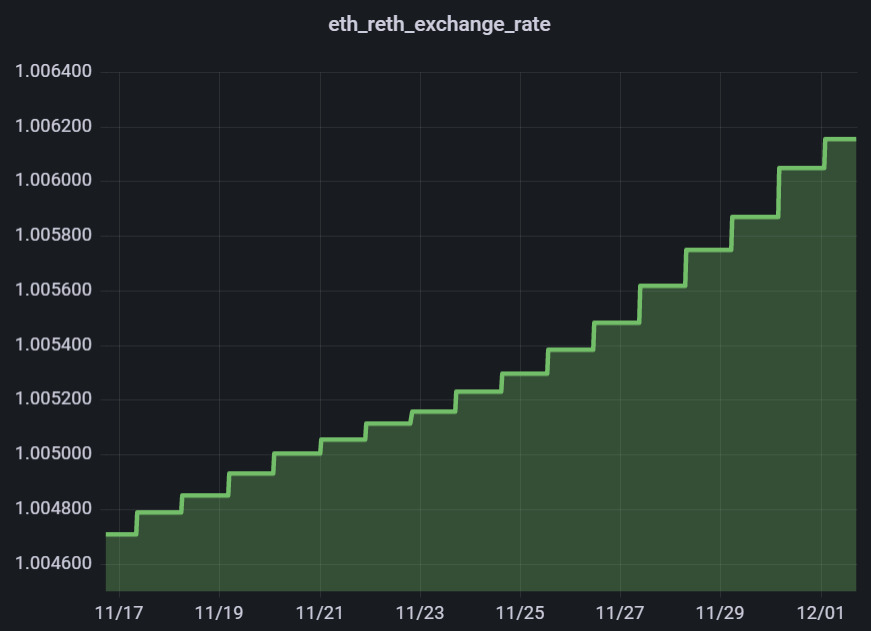

# Staking - Aperçu

Ce guide vous présentera le fonctionnement du staking avec Rocket Pool (comment vos ETH sont mis au travail et vos récompenses sont générées) et résumera les moyens par lesquels vous pouvez staker.

::: tip NOTE
Si vous n'êtes pas intéressé par le fonctionnement du staking et que vous voulez simplement apprendre à staker, [**cliquez ici pour passer à cette section.**](#how-to-stake-with-rocket-pool)
:::


## Comment fonctionne le Staking de ETH2

Avant de se lancer dans Rocket Pool, le staking sur la [Beacon Chain](https://ethereum.org/en/eth2/beacon-chain/) (ETH2) se fait via des **validateurs**.
Un validateur est une adresse ETH2 unique, à laquelle 32 ETH ont été déposés, qui est maintenant responsable du maintien de la cohérence et de la sécurité de la Beacon Chain.
Il le fait en écoutant les transactions et les propositions de nouveaux blocs, et en **attestant** que le bloc proposé contient des transactions légales et valides en effectuant des calculs et des vérifications en arrière plan.
Parfois, il propos lui-même de nouveaux blocs.

Les validateurs d'ETH2 se voient attribuer des attestations et des propositions de blocs **selon un calendrier**.
C'est très différent du système de Proof-of-work d'ETH1, où chacun essaie constamment de rivaliser avec les autres et de proposer le prochain bloc avant tout le monde.
Cela signifie que, contrairement à ETH1 où un mineur n'est pas assuré de gagner un bloc de récompense à moins qu'il ne trouve le prochain bloc, les validateurs ETH2 sont assurés d'avoir un revenu lent et régulier tant qu'ils remplissent leurs fonctions.
Si un validateur est hors ligne et manque une attestation ou une proposition de bloc, il sera **légèrement pénalisé**.
En règle générale, si un validateur est hors ligne pendant X heures, il récupérera tous les ETH perdus après les mêmes X heures de remise en ligne.

Selon les règles actuelles de Proof-of-Stake, toutes les attestations et propositions de blocs sont délivrées sur la Beacon Chain.
Jusqu'à ce que les retraits de la Beacon Chain soient implémentés par les core developers d'Ethereum, cela signifie **qu'il n'y a actuellement aucun moyen d'accéder à l'ETH mis en jeu ou à ses récompenses**.
Les validateurs vont simplement accumuler des soldes de plus en plus importants jusqu'à ce qu'ils **désactivent volontairement** le validateur (ou qu'ils soient **slashés** pour avoir tenté d'attaquer le réseau).
Ces deux actions libéreront le validateur de ses fonctions et rendront le solde à l'opérateur sur la chaîne ETH1 une fois que les retraits auront été effectués.


## Comment fonctionne Rocket Pool

Contrairement aux stakers en solo, qui doivent déposer 32 ETH pour créer un nouveau validateur, les nœuds de Rocket Pool ne doivent déposer que 16 ETH par validateur.
Ce dépôt sera couplé aux 16 ETH du staking pool (que les stakers ont déposé en échange de rETH) pour créer un nouveau validateur ETH2.
Ce nouveau validateur est appelé **minipool**.

Pour la Beacon chain, un minipool a les mêmes caractéristiques qu'un validateur normal.
Il a les mêmes responsabilités, les mêmes règles qu'il doit suivre, les mêmes récompenses, et ainsi de suite.
La seule différence réside dans la façon dont le minipool a été créé sur la chaîne ETH1, et dans la façon dont les retraits fonctionnent lorsque l'opérateur du nœud décide de désactiver volontairement le minipool ou se fait slashé.
Toutes les étapes de création, de retrait et de délégation des récompenses sont gérées par les **contrats intelligents** de Rocket Pool sur la chaîne ETH1.
Cela rend le système complètement décentralisé.


## Le Token rETH

En tant que staker sur Rocket Pool, votre rôle est de déposer des ETH dans le pool de dépôt qui permettra à un opérateur de nœud de créer un nouveau validateur de la Beacon Chain.
Vous pouvez staker aussi peu que **0.01 ETH**.

En faisant cela, vous recevrez un token appelé **rETH**. Le rETH représente à la fois **la quantité** d'ETH que vous avez déposé et **le moment** où vous l'avez déposé.
La valeur du rETH est déterminée par le ratio suivant :

```
ratio rETH:ETH =  (total ETH staké + récompenses Beacon Chain) / (total ETH staké)
```

Étant donné que les récompenses de la Beacon Chain seront toujours positives et en constante augmentation, cela signifie que **la valeur de rETH augmente toujours par rapport à ETH**.
Le taux de change rETH/ETH est mis à jour environ toutes les 24 heures en fonction des récompenses de la Beacon Chain perçues par les opérateurs de nœuds Rocket Pool.

Pour illustrer ce point, voici un graphique de la valeur de rETH (par rapport à ETH) au fil du temps - comme prévu, il montre une croissance lente mais régulière :

<center>



</center>

Prenons un exemple simple à titre de démonstration.

Disons que vous stakez au tout début lorsque 1 ETH = 1 rETH.
Vous déposez 10 ETH et recevez 10 rETH en retour.

Après quelques années, les soldes sur la Beacon Chain augmentent grâce aux récompenses des validateurs.
Supposons que 128 ETH aient été stakés avec Rocket Pool et que la somme de tous les soldes des validateurs sur ETH2 soit de 160 ETH.
Alors 1 ETH vaudrait (128/160) = 0.8 rETH ; inversement, 1 rETH vaudrait (160/128) = 1.25 ETH.

À ce stade, vous pourriez échanger vos 10 rETH avec les contrats intelligents de Rocket Pool et recevoir 12.5 ETH en retour.

Cela signifie que **tant que vous détenez des rETH**, vous stakez avec Rocket Pool !
**Vous n'avez pas besoin de l'obtenir directement de Rocket Pool.**
Par exemple, vous pouvez acheter des rETH sur un marché d'échange ; comme chaque token rETH est exactement le même, vous **recevrez automatiquement les avantages du staking simplement en détenant le token!**


::: warning NOTE
Échanger des rETH contre des ETH directement avec Rocket Pool n'est possible que si le pool de staking contient suffisamment d'ETH pour traiter votre transaction.
L'ETH dans ce pool provient de deux sources :

1. L'ETH que d'autres stakers ont déposé et qui n'a pas encore été utilisé par un opérateur de nœud pour créer un nouveau validateur.
2. L'ETH qui a été retourné par un opérateur de nœud après avoir quitté un de ses validateurs et reçu ses récompenses de la Beacon Chain (**notez que cela n'est pas possible avant que la fusion ETH1-ETH2 ne se produise et que les retraits ne soient activés**)

Il est possible que si les opérateurs de nœuds ont mis tout le pool de staking au travail sur la Beacon Chain, alors le pool de liquidité n'aura pas assez de solde pour couvrir votre dé-staking.
Dans ce cas, vous pouvez trouver d'autres moyens d'échanger vos rETH contre des ETH (par exemple sur un marché d'échange décentralisé comme [Uniswap] (https://app.uniswap.org/#/swap)) - bien que cela soit probablement accompagné d'une petite majoration.
:::

Comme alternative à la conservation et au retour éventuel de votre rETH dans le Rocket Pool, vous êtes également libre de **l'utiliser dans des applications DeFi**.
Vous pouvez l'échanger, le prêter, l'utiliser comme collatéral... comme le rETH est un token standard ERC20, vous pouvez l'utiliser de toutes les manières que vous pourriez utiliser n'importe quel autre token.

::: tip NOTE
Après la fusion de l'Ethereum Proof-of-Stake (PoS) et l'activation des retraits de l'ETH staké, **rETH restera un jeton ERC-20 distinct de l'ETH**.
:::


## Implications fiscales

Chaque pays a ses propres lois fiscales, et il serait impossible de toutes les documenter ici.  
Dans certains pays, le dépôt d'ETH contre des rETH peut être considéré comme **une transaction imposable**.
Cependant, comme le rETH accumule intrinsèquement de la valeur alors que le montant réel du jeton que vous détenez reste constant, le simple fait de le détenir ne génère généralement **aucune transaction imposable**.

Cela peut faire du rETH **un token de staking à privilégier pour une détention à long terme** si votre pays sépare les taxes sur les plus-values à court et à long terme.

Les lois fiscales relatives aux crypto-monnaies n'en sont qu'à leurs débuts ; chaque utilisateur doit faire ses propres recherches et envisager de s'adresser à un professionnel de la fiscalité.  

Vous trouverez ci-dessous quelques sites utiles qui offrent une assistance fiscale aux utilisateurs en rapport avec Ethereum.
**Il ne s'agit pas d'une recommandation officielle - il est conseillé aux utilisateurs de faire leurs propres recherches concernant les implications et les stratégies fiscales**:
 - [https://koinly.io/](https://koinly.io/)
 - [https://cryptotaxcalculator.io/](https://cryptotaxcalculator.io/)


## Comment Staker avec Rocket Pool

Comme décrit ci-dessus, tant que vous détenez le jeton rETH, vous êtes un **Rocket Pool Staker**.
Nous allons résumer ici plusieurs manières courantes de l'acquérir.

::: warning NOTE
Toutes les méthodes décrites ici reposent sur l'utilisation d'un portefeuille Ethereum tel que [MetaMask] (https://metamask.io/).
Si vous n'avez jamais utilisé de porte-monnaie Ethereum auparavant, nous vous encourageons vivement à en apprendre davantage à leur sujet et à vous entraîner à les utiliser avant de staker avec Rocket Pool.
Les sections ci-dessous comprennent certaines étapes qui sont démontrées avec MetaMask comme exemple ; elles devraient s'appliquer à votre portefeuille de choix assez facilement pour que vous puissiez les suivre.
:::


### Via Rocket Pool directement
Avec cette méthode, vous utiliserez un portefeuille web3 (tel que MetaMask) et interagirez avec le site Web de Rocket Pool pour échanger des ETH contre des rETH et vice-versa.
Cette méthode est **assurée** de vous fournir le montant exact de rETH que votre ETH vaut, puisqu'il provient directement des contrats intelligents de Rocket Pool, mais elle peut être un peu coûteuse si les prix du gas du réseau sont élevés et que vous stakez un montant relativement faible d'ETH.

Notez toutefois que vos jetons rETH seront **bloqués à votre adresse pendant 24 heures** si vous utilisez cette méthode afin de prévenir les attaques temporelles sur le réseau.

::: tip NOTE
Si vous vous entraînez au staking sur le Testnet Prater, la méthode directe ci-dessus est la seule option actuellement prise en charge.
:::

[Cliquez ici pour savoir comment staker directement via Rocket Pool.](./via-rp.md)


### Via un échange décentralisé sur Ethereum (Layer 1)
Avec cette méthode, vous accédez à un échange décentralisé tel que [Uniswap] (https://docs.uniswap.org/protocol/introduction) et achetez des rETH en utilisant le token de votre choix, comme vous le feriez pour tout autre échange de tokens.
Cette méthode s'accompagne de **frais de transaction moins élevés** que l'échange direct via le site web de Rocket Pool, mais il se peut que vous receviez moins de rETH que la valeur réelle en fonction de la liquidité et des frais que les fournisseurs de liquidité appliquent.

Notez que vos rETH ne seront **pas verrouillés à votre adresse** si vous stakez via un échange.
Vous pouvez les déplacer ou les utiliser immédiatement.

[Cliquez ici pour apprendre comment échanger de l'ETH contre du rETH via un échange décentralisé sur le Layer 1.](./via-l1.md)


### Via un échange décentralisé sur un réseau Ethereum Layer 2
Avec cette méthode, vous commencerez par transposer vos ETH existants (ou d'autres tokens de votre choix) sur un réseau Ethereum Layer 2 tel que [Optimism](https://www.optimism.io/) ou [Arbitrum](https://arbitrum.io/), puis vous utiliserez un échange décentralisé sur le réseau pour acheter des rETH. Si vous avez déjà des jetons sur un réseau Layer 2, cette méthode est attrayante car **les frais de transaction sont ~10x plus faibles que sur le réseau principal Ethereum**. Cependant, si vous n'avez jamais utilisé un réseau Layer 2 auparavant, la mise en place de cette méthode nécessite quelques étapes supplémentaires.

Notez que vos rETH ne seront **pas verrouillés à votre adresse** si vous stakez via un échange.
Vous pouvez les déplacer ou les utiliser immédiatement.

[Cliquez ici pour apprendre comment échanger de l'ETH contre du rETH via un échange décentralisé sur un réseau Layer 2.](./via-l2.md)


### Vidéo de démonstration (en anglais)


Le membre de la communauté **Kevster** a réalisé une vidéo utile (en anglais) qui présente chacune de ces options étape par étape :

<center>
<iframe width="560" height="315" src="https://www.youtube.com/embed/doXK3iDoQgI" title="YouTube video player" frameborder="0" allow="accelerometer; autoplay; clipboard-write; encrypted-media; gyroscope; picture-in-picture" allowfullscreen></iframe>
</center>

Pour une description plus détaillée, sélectionnez la méthode que vous souhaitez utiliser dans les liens ci-dessus et suivez le guide de cette section.
