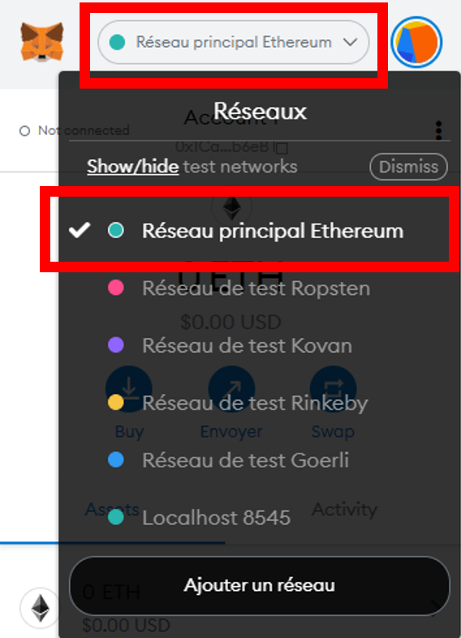
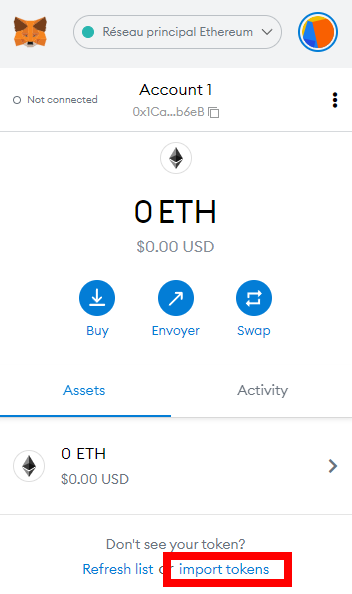
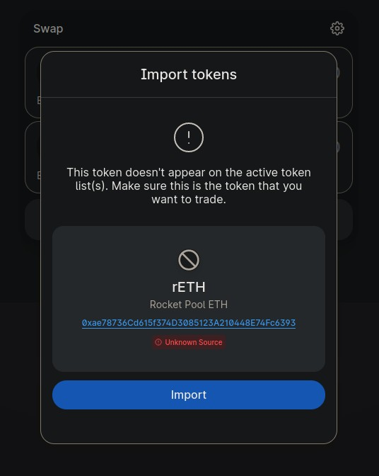
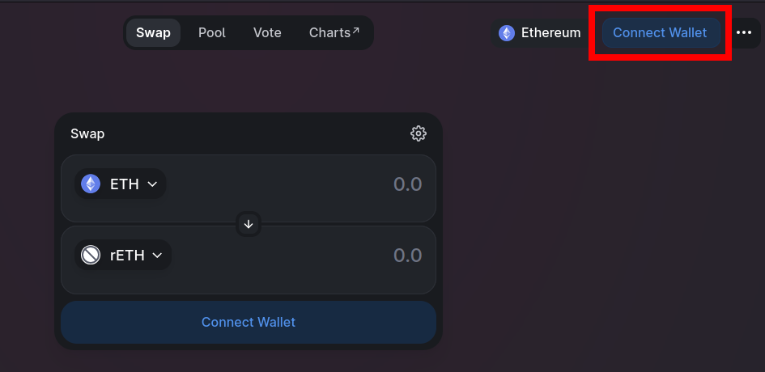
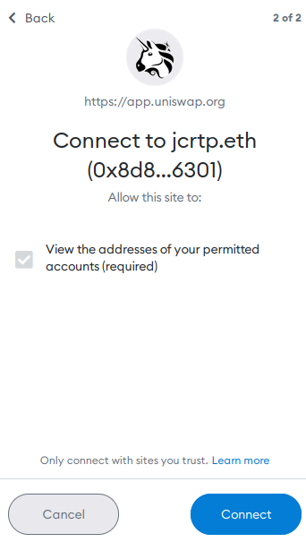
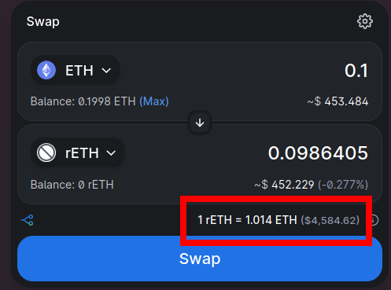
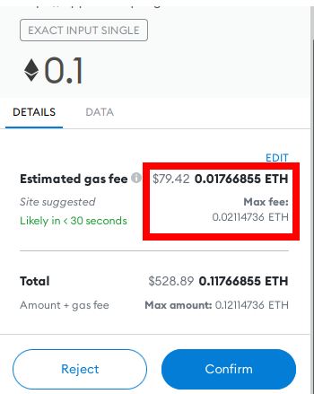

# Staking via un échange décentralisé sur le réseau Ethereum (Layer 1)

Pour rappel, il n'est pas nécessaire d'échanger des ETH contre des rETH directement via Rocket Pool pour profiter des avantages du staking décentralisé.
Tout ce que vous avez à faire est de détenir des rETH car leur valeur augmente de manière inhérente - la manière dont vous les obtenez n'a pas d'importance !

De nombreux membres de la communauté Rocket Pool ont rendu les rETH échangeables sur des échanges décentralisés, tels que [Uniswap] (https://docs.uniswap.org/protocol/introduction).
L'avantage d'utiliser un échange au lieu de Rocket Pool directement est qu'il **tend à avoir des frais de gas moins élevés**.
Si cela est important pour vous parce que vous voulez staker une petite quantité d'ETH, alors l'utilisation d'un échange décentralisé pourrait être préférable.

L'inconvénient est que vous n'obtiendrez peut-être pas la meilleure offre sur les rETH.
Uniswap perçoit une petite commission qui est reversée à ses fournisseurs de liquidités; de plus, le prix exact peut ne pas correspondre au prix indiqué par Rocket Pool, mais il est généralement arbitré à une valeur très proche, ce qui ne pose pas de problème.
Néanmoins, c'est toujours une bonne idée de comparer le taux que vous recevriez sur un échange avec le taux de change selon Rocket Pool.  

Dans l'exemple suivant, nous utiliserons Uniswap pour montrer comment échanger des ETH contre des rETH.

::: warning NOTE
Actuellement, cette méthode n'est disponible que sur le réseau principal Ethereum (Mainnet).
Si vous voulez vous entraîner sur le Testnet Prater, vous devez [échanger directement avec Rocket Pool](./via-rp.md).

**Le reste de ce guide suppose que vous êtes sur le réseau principal Ethereum.**
:::

Ce processus peut être effectué avec n'importe quel porte-monnaie compatible web3.
Pour les besoins de la démonstration, nous allons utiliser [MetaMask](https://metamask.io/) car c'est l'un des portefeuilles les plus populaires.

**Vous devriez pouvoir suivre les mêmes étapes avec un autre portefeuille si vous le souhaitez - il suffit de trouver la fonction comparable dans votre portefeuille pour chaque étape.**


## Configuration de MetaMask

Commencez par installer [MetaMask] (https://metamask.io/) si ce n'est pas déjà fait.
Suivez les instructions sur leur site pour installer l'extension, créer un compte et vous connecter.

Ensuite, ouvrez le panneau MetaMask en utilisant son icône dans la barre d'outils de votre navigateur.
Cliquez sur la liste déroulante **Réseaux** dans la barre d'outils en haut et assurez-vous que **Réseau principal Ethereum** est sélectionné:

<center>



</center>

Enfin, ajoutez le jeton rETH à MetaMask pour pouvoir voir votre solde et y accéder pour le trading.
Cliquez sur l'onglet **Assets**, puis sur **import tokens**:

<center>



</center>

Assurez-vous que **Jeton personnalisé** est sélectionné dans cette boîte de dialogue.
Dans la case **Adresse du contrat du jeton**, mettez la valeur suivante:

```
0xae78736Cd615f374D3085123A210448E74Fc6393
```

Le **Symbole du Jeton** devrait automatiquement être complété par `rETH`, et **Décimales de précision** devrait automatiquement être complété par `18`.

Acceptez le reste des invites, et vous verrez le token rETH apparaître dans votre liste.

Maintenant que vous avez une adresse de portefeuille dans MetaMask, vous devez y transférer de l'ETH.
**Vous devrez fournir cela à partir d'un portefeuille existant ou acheter des ETH sur un échange.**


## Échange de rETH via Uniswap

Maintenant que votre portefeuille est configuré et approvisionné, rendez-vous à cette URL qui ouvrira Uniswap et affichera automatiquement l'échange d'ETH contre des rETH:

[https://app.uniswap.org/#/swap?inputCurrency=eth&outputCurrency=0xae78736cd615f374d3085123a210448e74fc6393](https://app.uniswap.org/#/swap?inputCurrency=eth&outputCurrency=0xae78736cd615f374d3085123a210448e74fc6393)

::: warning NOTE
Vous pouvez initialement être acueilli par un warning NOTE qui ressemble à ceci:

<center>



</center>

Il s'agit simplement d'un avertissement temporaire jusqu'à ce qu'Uniswap ajoute rETH à sa liste de jetons de référence.
Tant que l'adresse du token est `0xae78736cd615f374d3085123a210448e74fc6393`, vous pouvez l'ajouter en toute sécurité.
:::

La page ressemblera à ceci initialement:

<center>



</center>

Cliquez sur l'un des boutons `Connect Wallet`, comme celui en surbrillance dans le coin supérieur droit.
Un écran vous demandera quel fournisseur de portefeuille vous souhaitez utiliser.
Pour cet exemple, sélectionnez **MetaMask**.

::: tip NOTE
Si vous n'utilisez pas MetaMask, l'un des autres fournisseurs tels que WalletConnect sera probablement compatible avec votre porte-monnaie.
:::

En cliquant sur ce bouton, MetaMask apparaîtra avec une invite vous demandant de sélectionner les comptes que vous souhaitez utiliser.
En supposant que vous n'en avez qu'un, votre compte devrait déjà être sélectionné.
Cliquez sur **Suivant**.

Il vous demandera ensuite si vous souhaitez donner à Uniswap l'accès à la visualisation des adresses de vos comptes:

<center>



</center>

Cliquez sur **Connect** et après une brève plage de temps, votre portefeuille sera connecté à Uniswap.
Vous devriez maintenant voir son solde d'ETH dans le coin supérieur droit de l'écran.

Maintenant, entrez la quantité d'ETH que vous voulez échanger et l'interface utilisateur d'Uniswap vous montrera la quantité de rETH que vous recevrez en retour:

<center>



</center>

::: warning NOTE
Notez que le montant de rETH que vous recevrez sera **inférieur** au montant d'ETH que vous avez investi.
C'est normal, car **le rETH vaut plus que l'ETH** et s'apprécie continuellement au fil du temps.
Vous pouvez le voir dans le taux de change mis en évidence en bas de la capture d'écran.
:::

Cliquez sur **Swap** pour voir les détails de la transaction, y compris le montant minimum que vous pourriez recevoir en raison du slippage.
Si vous êtes satisfait, cliquez sur **Confirm Swap**.
Cela enverra la demande à MetaMask, où vous pourrez examiner le coût total de la transaction avant de la confirmer:

<center>



</center>

::: warning NOTE
Prêtez **une attention particulière** à l'estimation des frais de gas ici, surlignée en rouge.
S'ils représentent une part importante de votre transaction globale (ici, plus de 17 %), il vous faudra **beaucoup de temps** avant d'atteindre le seuil de rentabilité des récompenses de staking.

Si c'est le cas, vous devriez soit attendre que le prix moyen du gas sur le réseau baisse, soit [envisager d'utiliser une solution de Layer 2 à la place](./via-l2.md).
::: 

Si vous êtes satisfait des frais de gas par rapport au montant total de rETH que vous recevrez, cliquez sur **Confirm** pour soumettre la transaction.
Après une courte période, vous devriez voir une notification de MetaMask indiquant que la transaction a été effectuée avec succès, et vous verrez maintenant le token rETH dans votre portefeuille.

Voilà, c'est fait! Vous êtes maintenant en train de staker avec Rocket Pool. Tout ce que vous avez à faire est de conserver vos tokens rETH, et vous obtiendrez automatiquement vos récompenses de staking au fur et à mesure que la valeur du token rETH augmente.
