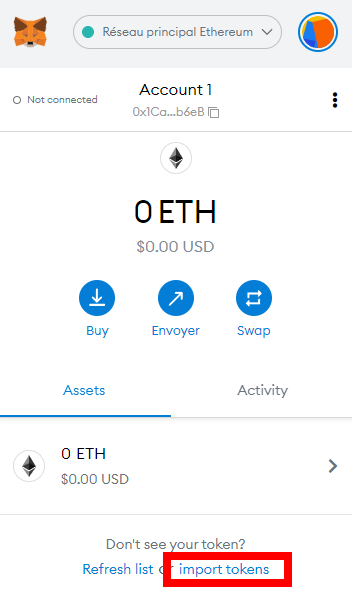

# Staker via un échange décentralisé sur un réseau de Layer 2

Pour rappel, vous n'avez pas besoin d'échanger de l'ETH contre du rETH directement via Rocket Pool pour profiter des avantages du staking décentralisé.
Tout ce que vous avez à faire est de détenir du rETH car sa valeur augmente de manière inhérente - la manière dont vous l'obtenez n'a pas d'importance !

Cela étant dit, l'une des principales préoccupations (surtout ces derniers temps) est le coût du gas associé au staking ou à l'échange d'ETH contre des rETH.

Pour aider à réduire ce problème, le réseau Ethereum a commencé à adopter l'utilisation de [rollups] (https://www.youtube.com/watch?v=7pWxCklcNsU) - également connu sous le nom de **Layer 2**.

Le Layer 2 comprend plusieurs réseaux distincts qui vivent sous Ethereum, exécutant de nombreuses transactions comme Ethereum le ferait normalement, mais les rassemblant toutes en une seule "méga" transaction et en postant *celle-ci* sur la chaîne principale d'Ethereum à la place.
Idéalement, cela signifie que vous bénéficiez de tous les avantages de sécurité associés à la nature décentralisée d'Ethereum, mais que vous profitez de **frais de gas beaucoup plus bas** pour vos transactions puisque les coûts d'exécution et de stockage sur les Layer 2 peuvent être beaucoup plus bas et que seule une partie de vos transactions doit être stockée sur le Layer 1.

Rocket Pool prend actuellement en charge deux réseaux de couche 2 : [Optimism](https://www.optimism.io/) et [Arbitrum](https://arbitrum.io/).
Tous deux possèdent des versions de [Uniswap](https://docs.uniswap.org/protocol/introduction), le protocole d'échange décentralisé le plus largement utilisé.
Avec Uniswap, vous pouvez échanger rapidement et facilement des ETH contre des rETH.

L'avantage d'utiliser cette approche est que **les frais de gas seront sensiblement inférieurs** à ceux des autres méthodes.
Si cela est important pour vous parce que vous voulez miser une petite quantité d'ETH, alors l'utilisation d'un réseau de Layer 2 sera probablement votre option de choix.

L'inconvénient est que vous n'obtiendrez peut-être pas la meilleure offre sur les rETH.
Uniswap prélève une petite commission qui est reversée à ses fournisseurs de liquidités, et les transactions importantes nécessiteront de grands pools de liquidités afin d'obtenir de bonnes affaires sans trop d'impact sur les prix.
Les réseaux de Layer 2 ont tendance à avoir une liquidité en rETH plus faible que le réseau principal d'Ethereum. 

Par conséquent, nous vous recommandons de comparer le total des rETH que vous obtiendriez sur un réseau de Layer 2 avec ce que vous obtiendriez via les autres méthodes afin de déterminer s'il est judicieux pour vous de suivre cette voie.

Vous pouvez consulter les soldes actuels d'ETH et de rETH du [pool Optimism] (https://optimistic.etherscan.io/address/0x8f477a5d632b5691a10a571575d55dc9c3d86d7c#tokentxns) et du [pool Arbitrum] (https://info.uniswap.org/#/arbitrum/pools/0xaac7de2b91293ba1791503d9127d2bdf2159db65) pour déterminer s'ils ont suffisamment de rETH pour couvrir votre échange.

Dans l'exemple suivant, nous allons montrer comment interagir avec les réseaux de Layer 2 et utiliser Uniswap pour échanger des ETH contre des rETH.

::: warning NOTE
Actuellement, cette méthode n'est disponible que sur le réseau principal Ethereum (Mainnet).
Si vous voulez vous entraîner sur le Testnet Prater, vous devez [échanger directement avec Rocket Pool](./via-rp.md).

**Le reste de ce guide suppose que vous êtes sur le réseau principal Ethereum.**
:::

Ce processus peut être effectué avec n'importe quel porte-monnaie compatible web3.
Pour les besoins de la démonstration, nous allons utiliser [MetaMask](https://metamask.io/) car c'est l'un des portefeuilles les plus populaires.

**Vous devriez pouvoir suivre les mêmes étapes avec un autre portefeuille si vous le souhaitez - il suffit de trouver la fonction comparable dans votre portefeuille pour chaque étape.**


## Configuration de MetaMask

Commencez par installer [MetaMask] (https://metamask.io/) si ce n'est pas déjà fait.
Suivez les instructions sur leur site pour installer l'extension, créer un compte et vous connecter.

Ensuite, ouvrez le panneau MetaMask en utilisant son icône dans la barre d'outils de votre navigateur.
Cliquez sur la liste déroulante **Réseaux** dans la barre d'outils en haut et assurez-vous que **Réseau principal Ethereum** est sélectionné :

<center>


</center>

L'adresse qui se trouve juste en dessous est votre **adresse de portefeuille Ethereum**.

Avant d'aller plus loin, vous devrez alimenter ce portefeuille en ETH.
Si vous n'avez pas déjà de l'ETH sur le compte suite à une utilisation antérieure, vous pouvez le faire en transférant de l'ETH d'un compte existant à cette adresse de portefeuille.


## Transférer des ETH du Layer 1 au Layer 2 via Hop

Il existe plusieurs façons de transférer des ETH du Mainnet d'Ethereum vers un réseau de Layer 2.
Dans cette démonstration, nous allons utiliser le protocole [Hop](https://docs.hop.exchange/faq) - un moyen simple et fiable de déplacer l'ETH (et quelques autres tokens) du Layer 1 vers plusieurs réseaux de Layer 2, ou entre des réseaux de Layer 2. 

Accédez au site Web de l'échange Hop ici :

[https://app.hop.exchange/send?token=ETH](https://app.hop.exchange/send?token=ETH)

L'écran d'accueil devrait ressembler à ceci:
<center>


</center>

Commencez par cliquer sur le bouton **Connect a Wallet** dans le coin supérieur droit.
Un message vous demandera quel fournisseur de porte-monnaie vous souhaitez utiliser.
Pour cet exemple, sélectionnez **MetaMask**.

::: tip NOTE
Si vous n'utilisez pas MetaMask, l'un des autres fournisseurs tels que WalletConnect sera probablement compatible avec votre porte-monnaie.
:::

En cliquant sur ce bouton, MetaMask apparaîtra avec une invite vous demandant de sélectionner les comptes que vous souhaitez utiliser.
En supposant que vous n'en avez qu'un, votre compte devrait déjà être sélectionné.
Cliquez sur **Suivant**.

Il vous demandera ensuite si vous souhaitez donner à Hop l'accès à la visualisation des adresses de vos comptes:

<center>


</center>

Cliquez sur **Connect** et après une brève plage de temps, votre portefeuille sera connecté à Hop.
Vous devriez maintenant voir son solde d'ETH dans le coin supérieur droit de l'écran.

Maintenant, vous pouvez utiliser les deux listes déroulantes dans les cases **From** et **To (estimated)** pour sélectionner vos réseaux, et entrer le montant d'ETH que vous voulez envoyer dans la case **From**.

Par exemple, voici à quoi cela ressemblerait d'envoyer 0.1 ETH depuis le Layer 1 à Arbitrum:

<center>


</center>

::: warning NOTE
Pour rappel, Uniswap (et donc le staking sur Rocket Pool) est actuellement **uniquement supporté sur Optimism et Arbitrum**.
Vous devez sélectionner l'un de ces réseaux.
:::

Lorsque vous êtes prêt, cliquez sur le bouton **Send**.
Metamask affichera une boîte de dialogue de confirmation qui vous indiquera les frais de gas associés à la transaction:


<center>


</center>

Si vous êtes à l'aise avec ces frais de gaz, cliquez sur **Confirm** pour commencer la transaction.
Après quelques instants, MetaMask affichera un message de confirmation de transaction réussie, et votre ETH sera désormais disponible sur le réseau de Layer 2 de votre choix !


## Se connecter à Uniswap sur Layer 2

Maintenant que votre portefeuille est configuré et approvisionné, rendez-vous à cette URL qui ouvrira Uniswap et affichera automatiquement l'échange d'ETH contre des rETH :

[https://app.uniswap.org/#/swap?inputCurrency=eth](https://app.uniswap.org/#/swap?inputCurrency=eth)

La page ressemblera à ceci au départ:

<center>


</center>

Cliquez sur l'un des boutons `Connect Wallet`, comme celui en surbrillance dans le coin supérieur droit.
Un écran vous demandera quel fournisseur de portefeuille vous souhaitez utiliser.
Pour cet exemple, sélectionnez **MetaMask**.

::: tip NOTE
Si vous n'utilisez pas MetaMask, l'un des autres fournisseurs tels que WalletConnect sera probablement compatible avec votre porte-monnaie.
:::

Une fois que vous aurez cliqué sur ce bouton, MetaMask vous demandera de sélectionner les comptes que vous souhaitez utiliser, comme pour Hop.
Laissez votre compte sélectionné, cliquez sur **Next**, puis cliquez sur **Connect** comme vous l'avez fait avec Hop auparavant.
Après une brève pause, votre portefeuille sera connecté à Uniswap.
Vous devriez maintenant voir son solde ETH dans le coin supérieur droit de l'écran.

La première chose à faire est de changer votre réseau du réseau principal d'Ethereum au Layer 2 sur lequel vous venez d'échanger.
Cliquez sur la liste déroulante des réseaux en haut à droite de l'écran (surlignée en rouge ici):

<center>


</center>

Une fois que vous l'aurez fait, MetaMask vous demandera de confirmer que vous voulez ajouter un réseau personnalisé:

<center>


</center>

Cliquez sur **Approve** et ensuite sur **Switch Network**.
Cela changera MetaMask pour utiliser le nouveau Layer 2 au lieu du réseau principal d'Ethereum pour les transactions.

::: warning NOTE
Avant d'effectuer des transactions avec MetaMask, vérifiez *toujours* le réseau utilisé en ouvrant MetaMask et en regardant la liste déroulante des réseaux en haut!
Il est facile de passer accidentellement à un réseau différent et d'oublier!
:::


## Ajouter rETH à MetaMask

L'étape suivante consiste à ajouter le token rETH à MetaMask afin que vous puissiez voir votre solde et y accéder pour le trading.
Cliquez sur l'onglet **Assets**, puis sur **import tokens**:

<center>



</center>

Assurez-vous que **Jeton personnalisé** est sélectionné dans cette boîte de dialogue, et sélectionnez l'onglet approprié pour le réseau de Layer 2 que vous avez choisi ci-dessous:

:::: tabs
::: tab Optimism

Dans la case **Adresse du contrat du jeton**, mettez la valeur suivante:

```
0x9bcef72be871e61ed4fbbc7630889bee758eb81d
```

Le **Symbole du Jeton** devrait automatiquement être complété par `rETH`, et **Décimales de précision** devrait automatiquement être complété par `18`.

Acceptez le reste des invites, et vous verrez le token rETH apparaître dans votre liste.

:::
::: tab Arbitrum

Dans la case **Adresse du contrat du jeton**, mettez la valeur suivante:

```
0xec70dcb4a1efa46b8f2d97c310c9c4790ba5ffa8
```

Le **Symbole du Jeton** devrait automatiquement être complété par `rETH`, et **Décimales de précision** devrait automatiquement être complété par `18`.

Acceptez le reste des invites, et vous verrez le token rETH apparaître dans votre liste.

:::
::::


## Échange de rETH via Uniswap

La dernière étape du processus est de faire l'échange!

Cliquez sur le menu déroulant **Select a token** et entrez l'adresse de rETH que vous venez d'ajouter à MetaMask (vous pouvez aussi simplement taper rETH, mais **assurez vous qu'il s'agit du bon token et non d'un imposteur ou d'un token d'arnaque** en vérifiant son adresse d'abord).

::: warning NOTE
Vous pouvez initialement être acueilli par un warning NOTE qui ressemble à ceci:

<center>


</center>

Il s'agit simplement d'un avertissement temporaire jusqu'à ce qu'Uniswap ajoute rETH à sa liste de jetons de référence sur le Layer que vous utilisez.
Tant que l'adresse du token est `0x9bcef72be871e61ed4fbbc7630889bee758eb81d` sur Optimism ou `0xec70dcb4a1efa46b8f2d97c310c9c4790ba5ffa8` sur Arbitrum, vous pouvez l'ajouter en toute sécurité.
:::

Ensuite, saisissez le montant d'ETH que vous souhaitez échanger et l'interface utilisateur d'Uniswap vous indiquera le montant de rETH que vous recevrez en retour:

<center>


</center>

::: warning NOTE
Notez que le montant de rETH que vous recevrez sera **inférieur** au montant d'ETH que vous avez investi.
C'est normal, car **le rETH vaut plus que l'ETH** et s'apprécie continuellement au fil du temps.
Vous pouvez le voir dans le taux de change mis en évidence en bas de la capture d'écran.
:::

Cliquez sur **Swap** pour voir les détails de la transaction, y compris le montant minimum que vous pourriez recevoir en raison du slippage.
Si vous êtes satisfait, cliquez sur **Confirm Swap**.
Cela enverra la demande à MetaMask, où vous pourrez examiner le coût total de la transaction avant de la confirmer:

<center>


</center>

::: tip NOTE
Prêtez **une attention particulière** à l'estimation des frais de gas ici.
Vous remarquerez probablement qu'il est **environ 10x moins cher** en termes de frais de gas pour faire cet échange sur un réseau de Layer 2 que sur le Mainnet Ethereum!
::: 

Si vous êtes satisfait des frais de gas par rapport au montant total de rETH que vous recevrez, cliquez sur **Confirm** pour soumettre la transaction.
Après une courte période, vous devriez voir une notification de MetaMask indiquant que la transaction a été effectuée avec succès, et vous verrez maintenant le token rETH dans votre portefeuille.

Voilà, c'est fait! Vous êtes maintenant en train de staker avec Rocket Pool. Tout ce que vous avez à faire est de conserver vos tokens rETH, et vous obtiendrez automatiquement vos récompenses de staking au fur et à mesure que la valeur du token rETH augmente.
