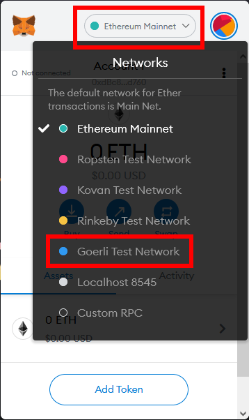
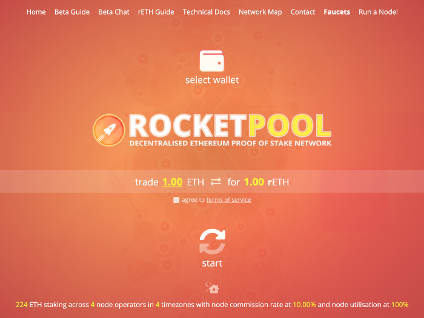
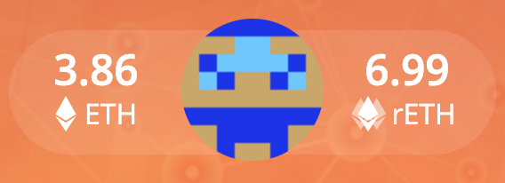
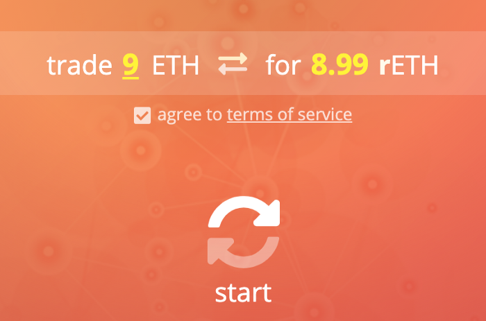
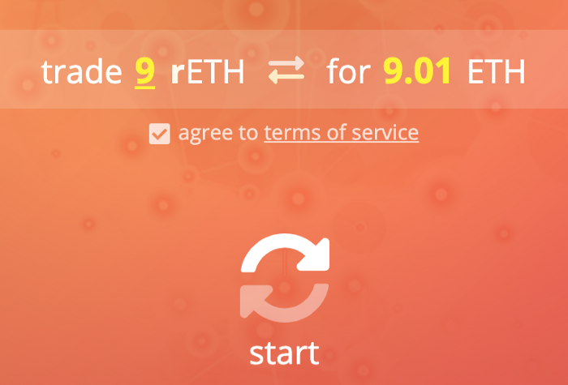

# Staker directement via Rocket Pool

La façon la plus simple de staker avec Rocket Pool est de le faire via son interface web pour accéder aux contrats intelligents sous-jacents.

L'avantage est que vous recevrez toujours exactement autant de rETH que votre ETH vaut, puisque les contrats de Rocket Pool monnayent directement les rETH que vous recevez.
Pas de frais supplémentaires, pas de slippage, pas de problèmes de liquidité, pas de prise en sandwich ou de front running... vous obtenez simplement le meilleur deal possible pour les rETH.

L'inconvénient est que les frais de gas peuvent être assez élevés si vous stakez un petit montant d'ETH - **nous vous recommandons fortement de vérifier cela avant d'approuver la transaction**.
De plus, il y a une limite à la quantité d'ETH qui peut être dans le pool à tout moment, il est donc possible que le pool soit plein jusqu'à ce que les opérateurs de nœuds en tirent de l'ETH et mettent cet ETH en staking sur la Beacon Chain.

::: warning NOTE
Si vous misez directement avec Rocket Pool, vos tokens rETH seront **bloqués sur votre compte pendant 24 heures** avant que vous puissiez les transférer ou les utiliser dans des applications DeFi.
Il s'agit d'une mesure de sécurité visant à prévenir les attaques temporelles.
Si vous obtenez vos rETH à partir d'un échange décentralisé, vos rETH ne seront **pas verrouillés**.

Veuillez prendre cela en considération lorsque vous décidez de staker directement ou non via Rocket Pool.
:::

La procédure est légèrement différente pour le Testnet Prater et le Mainnet, choisissez donc le réseau qui vous intéresse dans les onglets ci-dessous.

::::::: tabs
:::::: tab Se préparer sur le Testnet Prater

::: danger WARNING
Lorsque vous vous entraînez au staking sur le réseau de test, vous **n'avez pas besoin de fournir vos véritables ETH** au cours de ce processus.
Vous recevrez des **faux ETH de test** à utiliser à la place.

**Ne tentez pas de déplacer votre ETH réel du Mainnet vers le Testnet ou vous le perdrez définitivement**.  
:::

Commencez par installer [MetaMask] (https://metamask.io/) si ce n'est pas déjà fait.
Suivez les instructions sur leur site pour installer l'extension, créer un compte et vous connecter.

Ensuite, ouvrez le panneau MetaMask en utilisant son icône dans la barre d'outils de votre navigateur.
Cliquez sur le menu déroulant **Réseaux** dans la barre d'outils en haut et sélectionnez **Réseau de test Goerli**:

<center>



</center>

Enfin, ajoutez le jeton rETH à MetaMask pour pouvoir voir votre solde et y accéder pour le trading.
Cliquez sur l'onglet **Assets**, puis sur **import tokens**:

<center>


</center>

Assurez-vous que **Jeton personnalisé** est sélectionné dans cette boîte de dialogue.
Dans la case **Adresse du contrat du jeton**, mettez la valeur suivante:

```
0x178e141a0e3b34152f73ff610437a7bf9b83267a
```

Le **Symbole du Jeton** devrait automatiquement être complété par `rETH`, et **Décimales de précision** devrait automatiquement être complété par `18`.

Acceptez le reste des invites, et vous verrez le token rETH apparaître dans votre liste.

Maintenant que vous avez une adresse de portefeuille dans MetaMask, vous devez y transférer de l'ETH.
Rendez-vous sur la page [Practicing with the Test Network](../testnet/overview.md#getting-test-eth-on-goerli) pour un guide rapide sur la façon d'utiliser un faucet testnet pour obtenir des ETH de test sur Goerli.

Une fois que vous avez quelques ETH de Goerli à tester, rendez-vous sur [https://testnet.rocketpool.net/](https://testnet.rocketpool.net/).

La page devrait ressembler à ceci:

<center>



</center>

Si vous voyez un message indiquant qu'un navigateur web3 est nécessaire, ou que l'ID réseau actuel n'est pas pris en charge, assurez-vous d'avoir effectué correctement les étapes précédentes avant de continuer.

::::::
:::::: tab Se préparer sur le Mainnet d'Ethereum

Commencez par installer [MetaMask] (https://metamask.io/) si ce n'est pas déjà fait.
Suivez les instructions sur leur site pour installer l'extension, créer un compte et vous connecter.

Ensuite, ouvrez le panneau MetaMask en utilisant son icône dans la barre d'outils de votre navigateur.
Cliquez sur la liste déroulante **Réseaux** dans la barre d'outils en haut et assurez-vous que **Réseau principal Ethereum** est sélectionné:

<center>


</center>

Enfin, ajoutez le jeton rETH à MetaMask pour pouvoir voir votre solde et y accéder pour le trading.
Cliquez sur l'onglet **Assets**, puis sur **import tokens**:

<center>


</center>

Assurez-vous que **Jeton personnalisé** est sélectionné dans cette boîte de dialogue.
Dans la case **Adresse du contrat du jeton**, mettez la valeur suivante:

```
0xae78736Cd615f374D3085123A210448E74Fc6393
```

Le **Symbole du Jeton** devrait automatiquement être complété par `rETH`, et **Décimales de précision** devrait automatiquement être complété par `18`.

Acceptez le reste des invites, et vous verrez le token rETH apparaître dans votre liste.

Maintenant que vous avez une adresse de portefeuille dans MetaMask, vous devez y transférer de l'ETH.
**Vous devrez fournir cela à partir d'un portefeuille existant ou acheter des ETH sur un échange.**

Une fois que vous avez quelques ETH à staker, dirigez-vous vers [https://stake.rocketpool.net/](https://stake.rocketpool.net/).

La page devrait ressembler à ceci:

<center>


</center>

Si vous voyez un message indiquant qu'un navigateur web3 est nécessaire, ou que l'ID réseau actuel n'est pas pris en charge, assurez-vous d'avoir effectué correctement les étapes précédentes avant de continuer.

::::::
:::::::


Une fois sur le site, cliquez sur le bouton **select wallet** en haut au milieu de la page, puis sur **connect metamask**.

MetaMask vous demandera de sélectionner un compte pour vous connecter au site.
Choisissez-en un, confirmez quelques autorisations, et vous verrez l'icône de votre compte ainsi que vos soldes ETH et rETH - par exemple:

<center>



</center>

Maintenant, il ne vous reste plus qu'à déposer vos ETH et à recevoir quelques rETH en retour!

Saisissez le montant d'ETH que vous souhaitez déposer dans la case **trade __ ETH** à l'écran, puis cochez la case **agree to terms of service** et appuyez sur **start**:

<center>



</center>

MetaMask affichera une fenêtre vous demandant de confirmer votre transaction.

**Vérifiez le coût total du gas de la transaction avant de l'approuver - s'il est très élevé par rapport à votre transaction, vous pouvez envisager d'acquérir du rETH par une autre méthode!**.

Une fois que vous l'aurez confirmée, la transaction commencera.
Une fois qu'elle a été minée et ajoutée à la chaîne, vous verrez vos soldes mis à jour!

::: tip NOTE
Comme décrit à la page précédente, il est **tout à fait normal** de recevoir moins de rETH que le montant d'ETH que vous avez investi.
Les rETH et les ETH ont un **taux de change dynamique**: au fur et à mesure que le réseau Rocket Pool gagne des récompenses, 1 rETH vaudra plus que 1 ETH, ce qui signifie que 1 ETH achètera moins que 1 rETH.
:::

Voilà, c'est fait!
Vous êtes maintenant en train de staker avec Rocket Pool.
Tout ce que vous avez à faire est de conserver vos tokens rETH, et vous obtiendrez automatiquement vos récompenses de staking au fur et à mesure que la valeur du token rETH augmente.

::: warning NOTE
Pour rappel, vos jetons rETH seront **bloqués sur votre compte pendant 24 heures** avant que vous puissiez les transférer ou les utiliser dans des applications DeFi.
Il s'agit d'une mesure de sécurité visant à prévenir les attaques temporelles.
:::


## Dé-staking

Lorsque vous êtes prêt à dé-stacker et à échanger vos rETH contre des ETH, retournez sur le site Web de staking et cliquez sur le **bouton double-flèche** au milieu de la boîte de dialogue des montants d'échange pour passer en mode rETH:

<center>



</center>

Comme pour le staking, entrez un montant de rETH à échanger en retour, acceptez les Terms of Service, et cliquez sur **start**.
Une fois de plus, une boîte de dialogue de confirmation apparaîtra dans MetaMask.
Confirmez la transaction, et une fois qu'elle a été minée, vous verrez les soldes appropriés dans votre portefeuille.

::: warning NOTE
L'échange de rETH contre de l'ETH n'est possible que si le **pool de liquidités en staking** contient suffisamment d'ETH pour traiter votre transaction.
Il s'agit du pool d'ETH de Rocket Pool qui provient de deux sources:

1. ETH que d'autres stakers ont déposé, qui n'a pas encore été utilisé par un opérateur de nœud pour créer un nouveau validateur
1. L'ETH qui a été retourné par un opérateur de nœud après avoir arrêté un de ses validateurs et reçu ses récompenses de la Beacon Chain (**notez que ceci n'est pas possible jusqu'à ce que la fusion ETH1-ETH2 se produise et que les retraits soient activés**)

Au cours de la période précédant la fusion (the Merge), il est possible que le pool de liquidité ne dispose pas d'un solde suffisant pour couvrir votre dé-staking.
Dans ce cas, vous pouvez trouver d'autres moyens d'échanger vos rETH contre des ETH (par exemple sur un marché d'échange décentralisé tel que [Uniswap] (https://app.uniswap.org/#/swap)) - bien qu'ils soient susceptibles d'être accompagnés d'une petite majoration.
:::

C'est tout ce qu'il y a à faire pour stacker avec Rocket Pool!
Nous espérons que vous avez trouvé le processus rapide et facile.

N'hésitez pas à vous rendre sur [notre serveur Discord (en anglais uniquement)] (https://discord.gg/G46XgK264a) pour nous dire ce que vous en avez pensé et suivre l'évolution du projet.
